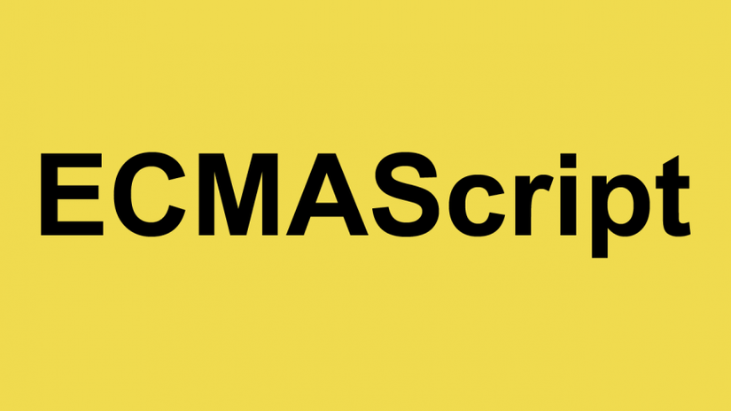

# **ECMAScript-Specifications**
 ```Contains all the approved and updated features by ECMAScript```





### What is ECMAScript?

ECMAScript is the scripting language standardized by Ecma International in the ECMA-262 specification. 
In short, ECMAScript is a language specification. Many languages follow and implement the ECMAScript specification, 
e.g., JavaScript, ActionScript, Nashorn.

Ecma international releases standard specifications from time to time. JavaScript just implements ECMAScript into a 
more mature and robust scripting language with various input and output methods which developers can in turn use to 
build various applications.

### Maturity Stages of ECMAScript

Each proposal for an ECMAScript feature goes through the following maturity stages (TC39 Maturity Stages):

|     | Stage Name| Stage Process       |
| --- | --------- | --------- |
| Stage 0 | **Strawman**  | Idea under discussion; Very highly likely to change or be dropped |
| Stage 1 | **Proposal**  | Initial draft for a formal proposal; Much likely could change or it could be dropped |
| Stage 2 | **Draft**  | First version of what will be in the specification; more likely to be included in standards, but changes can occur  |
| Stage 3 | **Candidate**  | Proposal is done, and needs feedback from implementations and users to continue; only harsh critical feedback can cause changes |
| Stage 4 | **Finished**  | The proposal is ready to be included in the standard  |


### List of Version from ES:

Till date, ES has published 11 versions and the latest one (11th version) was published in the year 

- ES1 1997
- ES2 1998
- ES3 1999
- ES4 Abandoned
- ES5 2009
- ES6 2015
- ES7 2016
- ES8 2017
- ES9 2018
- ES10 2019
- ES11 

ECMA Script's first three versions- ES1, ES2, ES3 were yearly updates whereas, ES4 was never released due to political 
disagreements. After a decade, ES5 was eventually released with several additions in 2009; post that ECMAScript became 
active again with release of ES6 in 2015.

#### Version History of ES Releases
| Edition | Date | Explore  |
| --- | --------- | --------- |
| [ES2015 Or ES6](es6/README.md)  | June 2015 | [Code Snippet]()  |
| [ES2016 Or ES7](es7/README.md)  | June 2016 | [Code Snippet]()  |
| [ES2017 Or ES8](es8/README.md)  | June 2017 | [Code Snippet]()  |
| [ES2018 Or ES9](es9/README.md)  | June 2018 | [Code Snippet]()  |
| [ES2019 Or ES10](es10/README.md)  | June 2019 | [Code Snippet]()  |
| [ES2020 Or ES11](es11/README.md)  | June 2020 | [Code Snippet]()  |

